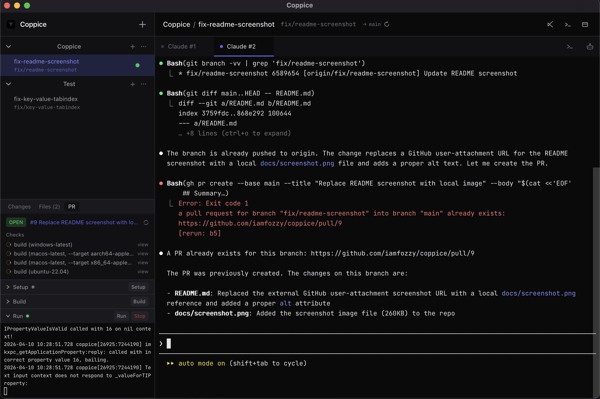

# Coppice

A desktop app for managing Git worktrees, Claude AI sessions, and development workflows in a unified interface. Built with Tauri v2, React, and Rust.

Coppice lets you work across multiple Git worktrees simultaneously, each with its own terminal sessions, Claude AI tabs, diff viewers, and configurable runners — all in one window.

## Installation

Download the latest build from [GitHub Actions](https://github.com/iamfozzy/coppice/actions) artifacts or [Releases](https://github.com/iamfozzy/coppice/releases).

### macOS — "App is damaged" fix

Since the app is not code-signed, macOS quarantines downloaded apps. After extracting, run:

```sh
xattr -cr /Applications/Coppice.app
```

Then open Coppice normally. You only need to do this once.

### Windows — SmartScreen warning

Since the app is not code-signed, Windows SmartScreen may block it on first launch. When you see the "Windows protected your PC" dialog, click **More info** then **Run anyway**. You only need to do this once.

## Features

### Worktree Management
- Create worktrees from existing or new branches
- Rename, pin, archive, and delete worktrees
- Live branch status polling (3-second intervals)
- Automatic `git worktree prune` before operations

### Integrated Terminal
- Full PTY-backed terminal sessions via xterm.js
- Per-worktree terminal tabs (unlimited)
- Cross-platform shell support (respects `$SHELL` on macOS/Linux, PowerShell on Windows)
- Unicode rendering for Claude Code UI elements
- Buffered output streaming (50ms flush interval) for smooth rendering

### Configurable Runners
- Define setup, build, and run commands per project
- Runners persist across worktree switches via an off-screen terminal pool
- Live status indicators (running/stopped/idle)
- Auto-run setup scripts on new worktree creation

### GitHub Integration
- Fetch PR status and check runs for any branch
- Create PRs directly from the app
- View failed CI logs inline
- CI status badges on worktree entries
- `gh` CLI is bundled with every release — sign in via **App Settings → GitHub** (no separate install required)

### File Diff Viewer
- Side-by-side diffs powered by Monaco Editor
- Two modes: uncommitted changes (HEAD vs working tree) and PR diffs (merge-base vs HEAD)
- Syntax highlighting for 20+ languages

### External Tool Launchers
- Open worktree in VS Code, native terminal, or file manager
- Cross-platform support (Finder/Explorer/xdg-open)

### Claude Agent SDK Integration
- Agent sessions are powered by [`@anthropic-ai/claude-agent-sdk`](https://www.npmjs.com/package/@anthropic-ai/claude-agent-sdk)
- A bundled Node "agent bridge" process (`src-tauri/resources/agent-bridge/`) drives the SDK over a JSON-line stdin/stdout protocol — one bridge process per agent session
- Rust backend (`src-tauri/src/commands/agent.rs`) spawns and manages bridge lifecycles; tool-use and `AskUserQuestion` round-trips block on frontend responses
- Bridge dependencies install automatically via the root `postinstall` script, so `npm install` in the repo root is all you need
- Node.js and `gh` binaries are bundled as Tauri sidecars (`src-tauri/binaries/coppice-node-*`, `coppice-gh-*`) so the packaged app has no external runtime dependencies. `npm install` downloads them for the host platform via `scripts/download-sidecars.mjs`; CI re-runs it per target triple.

## Tech Stack

| Layer | Technology |
|-------|-----------|
| Framework | Tauri 2 |
| Frontend | React 19, TypeScript, Vite 8 |
| Styling | Tailwind CSS 4 |
| State | Zustand 5 |
| Terminal | xterm.js 6 |
| Diff Editor | Monaco Editor |
| Backend | Rust (2021 edition) |
| Database | SQLite via rusqlite (WAL mode) |
| PTY | portable-pty |
| GitHub | `gh` CLI |

## Project Structure

```
├── src/                          # React frontend
│   ├── components/
│   │   ├── Sidebar/              # Project tree, changes panel, runners
│   │   ├── WorktreeView/         # Worktree header & tab bar
│   │   ├── Terminal/             # xterm.js terminal wrapper
│   │   ├── DiffViewer/           # Monaco diff editor
│   │   ├── PRStatus/             # GitHub PR info panel
│   │   └── ProjectSettings/      # Project configuration modal
│   ├── stores/appStore.ts        # Global state (Zustand)
│   ├── lib/commands.ts           # Tauri IPC wrappers
│   └── lib/types.ts              # Shared TypeScript types
├── src-tauri/                    # Rust backend
│   ├── src/
│   │   ├── commands/
│   │   │   ├── project.rs        # Project CRUD
│   │   │   ├── worktree.rs       # Git worktree operations
│   │   │   ├── terminal.rs       # PTY spawn/write/resize/kill
│   │   │   ├── github.rs         # PR status, CI logs, PR creation
│   │   │   └── external.rs       # VS Code, terminal, file manager
│   │   ├── db/mod.rs             # SQLite schema & queries
│   │   ├── models/mod.rs         # Project, Worktree structs
│   │   └── services/pty_manager.rs # PTY lifecycle & output streaming
│   ├── Cargo.toml
│   └── tauri.conf.json
└── .github/workflows/build.yml   # Multi-platform CI
```

## Prerequisites

- **Node.js** 20+
- **Rust** (via [rustup](https://rustup.rs))
- **`gh` CLI** (for GitHub features) — [install](https://cli.github.com)

### Platform-specific

**macOS:** Xcode Command Line Tools
```sh
xcode-select --install
```

**Linux (Ubuntu/Debian):**
```sh
sudo apt-get install -y \
  libgtk-3-dev \
  libwebkit2gtk-4.1-dev \
  libayatana-appindicator3-dev \
  librsvg2-dev \
  patchelf
```

**Windows:** C++ Build Tools (via Visual Studio Installer)

## Development

```sh
# Install dependencies
npm install

# Start dev server with hot reload
npx tauri dev
```

This launches Vite on `http://localhost:1420` and opens the Tauri window with live frontend reloading.

### Build

```sh
# Production build
npx tauri build

# Build for specific target
npx tauri build --target aarch64-apple-darwin
```

Bundles are output to `src-tauri/target/release/bundle/`.

## CI/CD

GitHub Actions builds on every push to `main` and on tags:

| Platform | Target |
|----------|--------|
| macOS | `aarch64-apple-darwin` (Apple Silicon) |
| macOS | `x86_64-apple-darwin` (Intel) |
| Ubuntu 22.04 | native |
| Windows | native |

Build artifacts (`.dmg`, `.app`, `.deb`, `.AppImage`, `.msi`, `.exe`) are uploaded as workflow artifacts. Tagged pushes (`v*`) create draft GitHub releases.

## Architecture Notes

- **Per-worktree isolation** — Each worktree gets its own set of tabs (terminal, Claude, diff) and runners, stored in `tabsByWorktree` and `runnersByWorktree` maps.
- **Terminal pool** — Runner terminals are rendered off-screen and reparented into the visible UI on demand, preserving terminal state across tab switches.
- **Event-driven PTY** — Output streams via Tauri events (`pty-output-{sessionId}`) rather than polling. A dedicated flush thread batches output every 50ms.
- **SQLite with WAL** — Database uses Write-Ahead Logging for concurrent read/write. Foreign keys enabled with cascading deletes on worktrees.
- **Git CLI** — All git operations shell out to `git` / `gh` directly (no libgit2), keeping the dependency surface small and behavior consistent with the user's git config.
- **Agent bridge subprocess** — Each Claude Agent SDK session runs in its own Node subprocess, isolated from the main app. Communication is line-delimited JSON over stdio, letting the Rust backend drive the SDK without embedding a JS runtime.

## License

MIT
